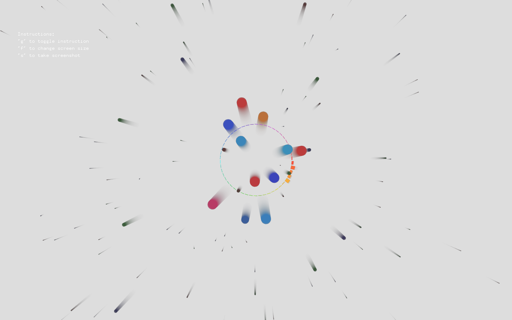
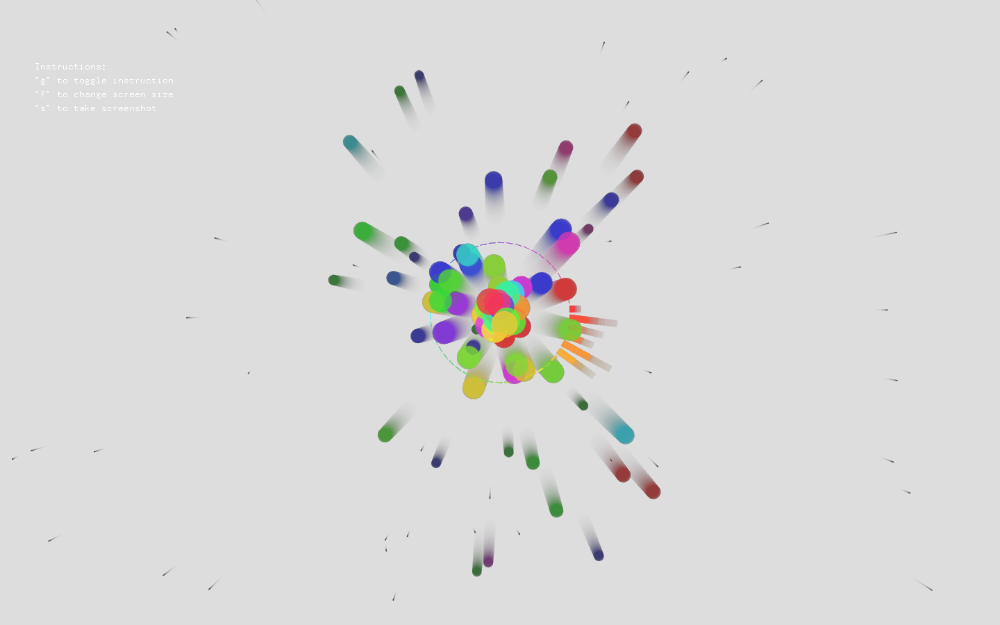

# Assignment2: Motion

## Description:

For this assignment, I wanted to create an animation that is also a form of audio visualizer. To understand how sound is played on openFrameworks, I followed this tutorial: https://www.youtube.com/watch?v=SSEnu6mp7y8. Once, I understood about the the sound spectrum and getting the bands of sound from the spectrum. 

### Concept

Music can have a profound effect on both the emotions and the body[1]. A slower tempo can quiet your mind and relax your muscles, making you feel soothed while releasing the stress of the day. Music is effective for relaxation and stress management. The concept of the art piece came from the fact that students get more stressted as we approach the finals week so this art piece was my approach to a motion work that would envoke relaxating emotions on the audience.

For the sound I chose a claming music with slower tempo  and chose pastel colors that go along the sound to give a calming, peaceful effect. 


## Challanges

The biggest challange I faced was understanding the what getSoundSpectrum returns in openframeworks, then sub dividing the spectrum into different bands to get an asthetically pleasing output.  

## Code:

The bars are visualizing the frequency bands and playback speed of the sound. Each bar watches a certain bandwidth, and increases its height when the audio hits the certain spectrum. 

I define a class particle, which is responsible to draw the circles, update the direction and clear the particle vector once the code finishes running. 

Class Particle 
```C++


class particle{
public:
    float size;
    glm::vec2 force, position, direction;
    
    void update();
    void draw();
    ofColor color;
    
    particle(int x, int y, int hue);
    ~particle();
};

```

If the value for the spectrum is greater than the threshold value (0.06 in my case), we create a new new particle from the center of the screen and push it to the particles vector. 

Condition to create a particle object 
```C++


if (fft[i] > 0.06){

    particle newParticles(ofGetWindowWidth()/2, ofGetWindowHeight()/2, hue);
    particles.push_back(newParticles);
}

```

To keep the code optimized, we clear the particles from the vector once the size of the cirlce is less than 0.

Condition to remove particles from the vector

```c++

for (int i=0; i<particles.size(); i++){
    particles[i].update();

    if (particles[i].size <= 0){

        particles.erase( particles.begin(), particles.begin()+i);
    }
}

```

### Screenshots





### Video:

https://user-images.githubusercontent.com/25387553/165071962-3abc7c2d-6cd6-43c5-9c04-ad0886ab5d53.mov


## Reflection

I am satisfied with the work that I could come up with, however, I would like to also incorporate audio input from the audience and also let the viewer choose their own audio.


[1] https://www.unr.edu/counseling/virtual-relaxation-room/releasing-stress-through-the-power-of-music

