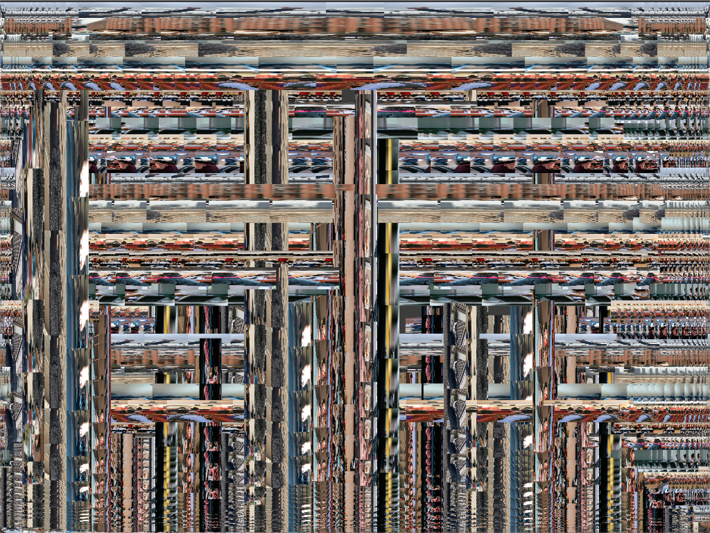

# SoundInput

**How much sould an artist have control on a prject?**

**Can sound produce art pieces?**

## Description

The idea for the project first came from the famous paintings of Gustav Klimt who ushered in a new period of figuration that jettisoned rigid tenets of naturalism and classicism. An example is attached below. Similarly, the art work by Zach Liberman, which was introduced to us in class. 

During my second assignment, I questioned myself whether the everyday sound we hear can produce a unique image. The sound at the dining hall, the sound at the football stadium or the sound of professors explaining in class. All the sounds at the moment are unique and they relate to a certain time. This made me question how I could combine sound to make art pieces that would evoke similar emotions as a Klimt. This led me to work with sound inputs based on their frequency bands, volume and pitch. To add unique color pallet, style and feelings, I use the image for a respective location. 

So if I want to create art based on sound of the certain location, I can take pictures of that location and use it them to determine the color pallet for the art piece.  

## Concept

The image bars are based on the sound bands of the particular space. I have divided the audiable sound into 32 bands and each of the bar represent the frequency band. The users have control over the maximum volume range, so as to allow the sound detection to be changed as per the need of the space. Higher volume range for louder places and lower for quiter places. The user also has control over the number of images to be used. Greater number of images means more diverse colors in the pallet and lower number represents more repetitions of same images. 

### Inspiration
---
| Syntax      | Description | 
| :---        |    :----:   |   
|    |       |  
| Gustav Klimt   | Zach Liberman        |  

The above images are my inspirations that led me to work on the project. 

### Algorithm


 Function to go through the list of bands and draw the different images (based on the input read on the particular band)
 
 ```C++
 
 void ProcessFFT::soundArtImage(){
    ofSetBackgroundAuto(false);
    // getting the width and height of the images
    int imgWidth = image[0].getWidth();
    int imgHeight = image[0].getHeight();
    
    
    // not normalized
    ofPushStyle();
    ofSetRectMode(OF_RECTMODE_CORNER);
    ofSetLineWidth(2);
    
    //for the number of columns
    for(int i=0; i<fftSpectrum.size(); i++){
         // display the image based on band
        drawImages(i);
           
    }
    ofPopStyle();
   
}

 
 ```
 
 Code to draw the differnt images on the band bar. The noImage variable controls the number of image to be displayed. 
 ```c++
 //portion of drawImages
 
 image[i%noImage].draw(ofGetWidth()*((float)i /numFFTbins), ofGetHeight() , ofGetWidth() /numFFTbins, -ofMap(fftSpectrum[i], 0, volumeRange, 0, ofGetHeight()  ));

 ```


## Output

#### [Video](https://www.youtube.com/watch?v=1Xj5tAwO0hI) with output at the end

*Image produced by D2 sounds when crowded*


*Image produced by D2 sounds when empty*


*Image produced by sounds of other presenting in class* 


## Reflection / Challenges

The first challange was finding a library that does the sound input processing, which was a difficult find. I had to edit the library to find a work around. I am not fully satisfied with the project however can see the potential that it can get to given that I put in more time and effort.

<!-- shapes
colors
rules
concept
story -->
