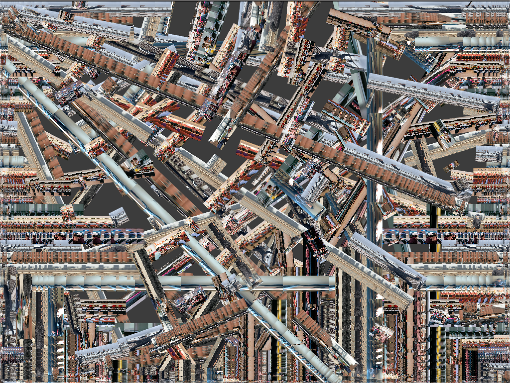

# SoundInput

**How much sould an artist have control on a prject?**

**Can sound produce art pieces?**

## Concept

The idea for the project first came from the famous paintings of Gustav Klimt who ushered in a new period of figuration that jettisoned rigid tenets of naturalism and classicism. An example is attached below. Similarly, the art work by Zach Liberman, which was introduced to us in class. 

During my second assignment, I questioned myself whether the everyday sound we hear can produce a unique image. The sound at the dining hall, the sound at the football stadium or the sound of professors explaining in class. All the sounds at the moment are unique and they relate to a certain time. This made me question how I could combine sound to make art pieces that would evoke similar emotions as a Klimt. This led me to work with sound inputs based on their frequency bands, volume and pitch. To add unique color pallet, style and feelings, I use the image for a respective location. So if I want to create sound based on a certain location, I can take pictures of that location and use it them to determine the color pallet for the art piece.  

### Inspiration
---
| Syntax      | Description | 
| :---        |    :----:   |   
|    |       |  
| Gustav Klimt   | Zach Liberman        |  

The above images are my inspirations that led me to work on the project. 

## Output

*Image produced by D2 sounds when crowded*


*Image produced by D2 sounds when empty*


*Image produced by sounds of other presenting in class* 


### Algorithm


 Function to go through the list of bands and draw the different images:
 
 ```C++
 
 void ProcessFFT::soundArtImage(){
    ofSetBackgroundAuto(false);
    // getting the width and height of the images
    int imgWidth = image[0].getWidth();
    int imgHeight = image[0].getHeight();
    
    
    // not normalized
    ofPushStyle();
    ofSetRectMode(OF_RECTMODE_CORNER);
    ofSetLineWidth(2);
    
    //for the number of columns
    for(int i=0; i<fftSpectrum.size(); i++){
         // display the image based on band
        drawImages(i);
           
    }
    ofPopStyle();
   
}

 
 ```
 
 ```c++
 //portion of drawImages
 
 image[i%noImage].draw(ofGetWidth()*((float)i /numFFTbins), ofGetHeight() , ofGetWidth() /numFFTbins, -ofMap(fftSpectrum[i], 0, volumeRange, 0, ofGetHeight()  ));

 ```


## Reflection / Challenges

<!-- shapes
colors
rules
concept
story -->
