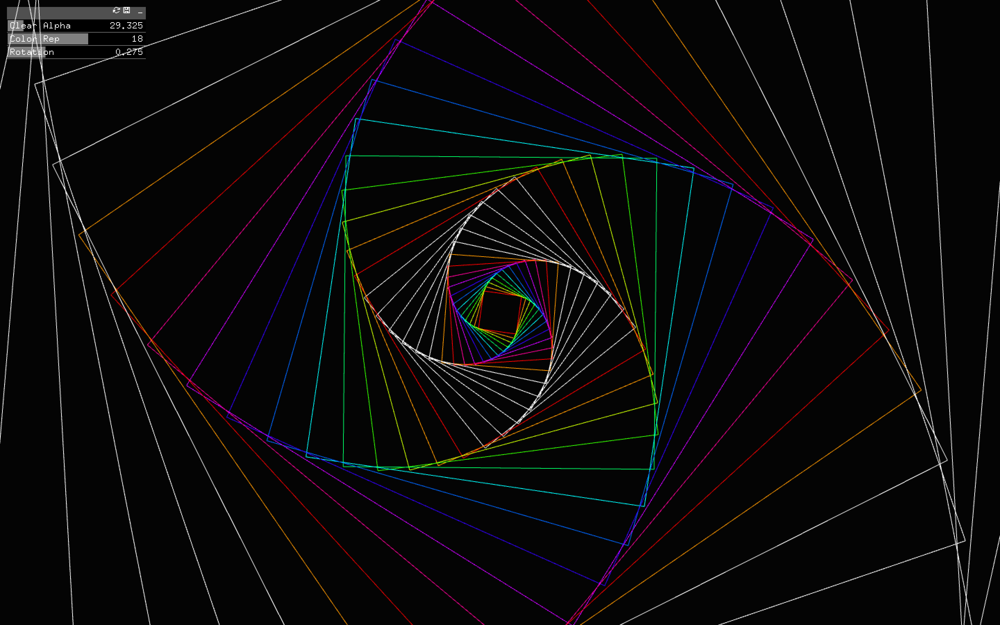
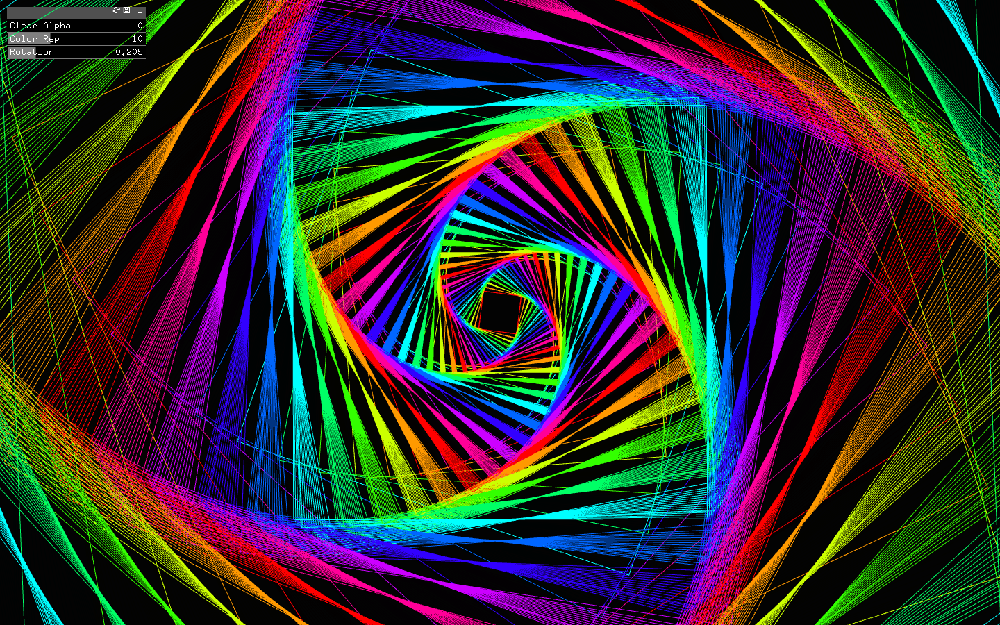

# Still


## Description

Spirals in Nature: [Galaxies](https://www.google.com/url?sa=i&url=https%3A%2F%2Fpixabay.com%2Fimages%2Fsearch%2Fspiral%2520galaxy%2F&psig=AOvVaw2CjqWG3u-D5-Xn58MVfgyb&ust=1649760452165000&source=images&cd=vfe&ved=0CAcQjRxqFwoTCMCohOLqi_cCFQAAAAAdAAAAABAI), [Ocean](https://www.worldatlas.com/r/w960-q80/upload/fc/ab/9b/shutterstock-1038169048.jpg), [Thumb Print](https://thumbs.dreamstime.com/b/human-fingerprint-finger-print-biometric-scan-line-art-vector-icon-apps-websites-human-fingerprint-finger-print-162436744.jpg)

The spirals in nature made me intrigued to experiment something similar for the first assignment. Additionally, I also took inspiration from Jan Stark's  [Vortex](https://www.jenstark.com/vortex) which was posted on the course discussion on Brightspace. I tried to replicate similar patterns which can then be controlled by sliders to generate unique patterns. I figured the colors for the shapes also give rise to different emotions, hence used straight lines and saturated colors. The GUI controllers lets the user control the rotation, color pallet and alpha of the screen clearning. 

**Inspiration:** https://www.jenstark.com/vortex

## Code

I started by looking for help in the of book chapter **[Into To Graphis](http://openframeworks.kr/ofBook/chapters/intro_to_graphics.html)** which helped me with a concept of having a rectangle that covers the whole screen with alpha between 0-1 (transparent) which semi clears the screen. The code for that is below: 

```C++

    // first setting the background to black
    ofColor darkColor(0,0,0,255);  // Opaque black
    ofColor bgColor = darkColor;
    bgColor.a = clearAlpha;
     
    // Semi-clear the screen, using a transparent rectangle
    ofSetColor(bgColor);
    
    ofSetRectMode(OF_RECTMODE_CORNER);
    ofFill();
    ofDrawRectangle(0, 0, ofGetWidth(), ofGetHeight());

```

So for the algorithm, I draw 100 squares from the center each scaled 10% more than the previous one. After that, I rotate each squares taking signedNoise to add a bit of noise to the rotations. For the color, I utilized the HSB color format. The staturation, brightness are set to the max value of 255, for the Hue it is repeated every 10 squared to begin with. (However, user can tweak the value of colorVal gui slider to change it).
```C++

for (int i=0; i<100; i++) {
        
        int val = i;
        val = val % colorVal;
        ofColor c;
        
        c.setHsb(ofMap(val, 0, 10, 0, 255), 255, 255, 255);
        ofSetColor(c);
        ofNoFill();
        
        // Draw the smallest rectangle first and scale out to bigger ones progressively
        ofScale(1.1, 1.1);

        
        float noise = ofSignedNoise(rotation) * 20.0;
        ofRotate(noise);

        ofDrawRectangle(0, 0, 50, 50);
    }
 
 
 ```

## Reflection 

I planned to make the art to be very stricking and evoke a strong emotion. So for that I resolved to the following features:

shapes: I decided to use lines because the human eye follows the path of the line. To evoke a strong sense of Instability and excitement, I utilized sharp lines.

color: Richly saturated colors make our imagery intense, brave and bold.

rules: I find it very intresting to see the formation of curves just by using straight lines.

For the first assignment, I am satisfied with what I was able to acheive. The shapes and colors evoked the emotions that I was going for. I now like to add animations to the shapes. I would have to acknowledge the OF Book and OF documentation.
 

## Screenshots

*Changing the value of rotation*



*Min value of alpha. Value for alpha = 0*




*Changing the color Representation*


