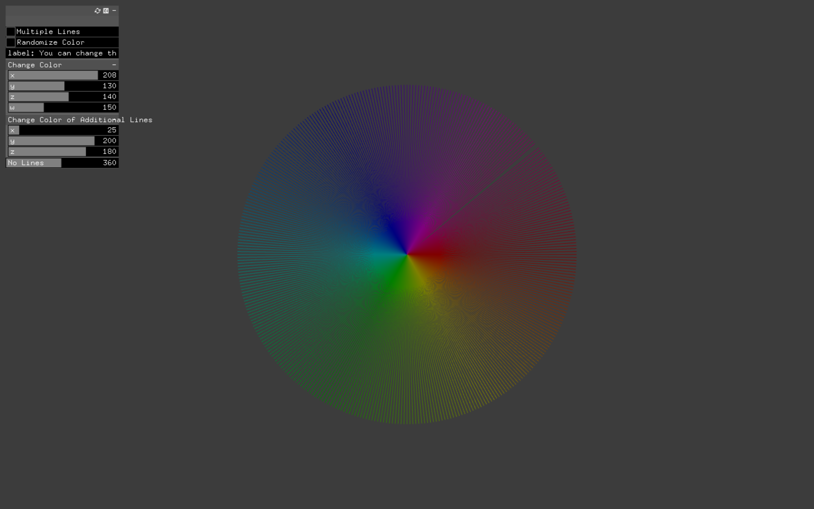
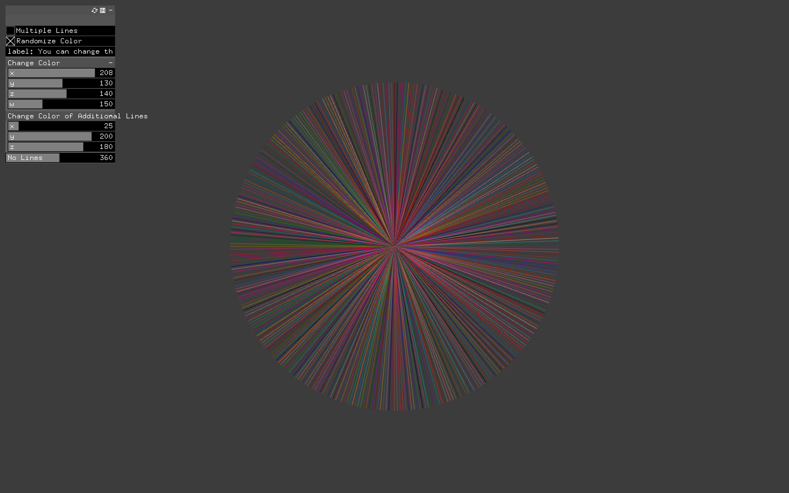
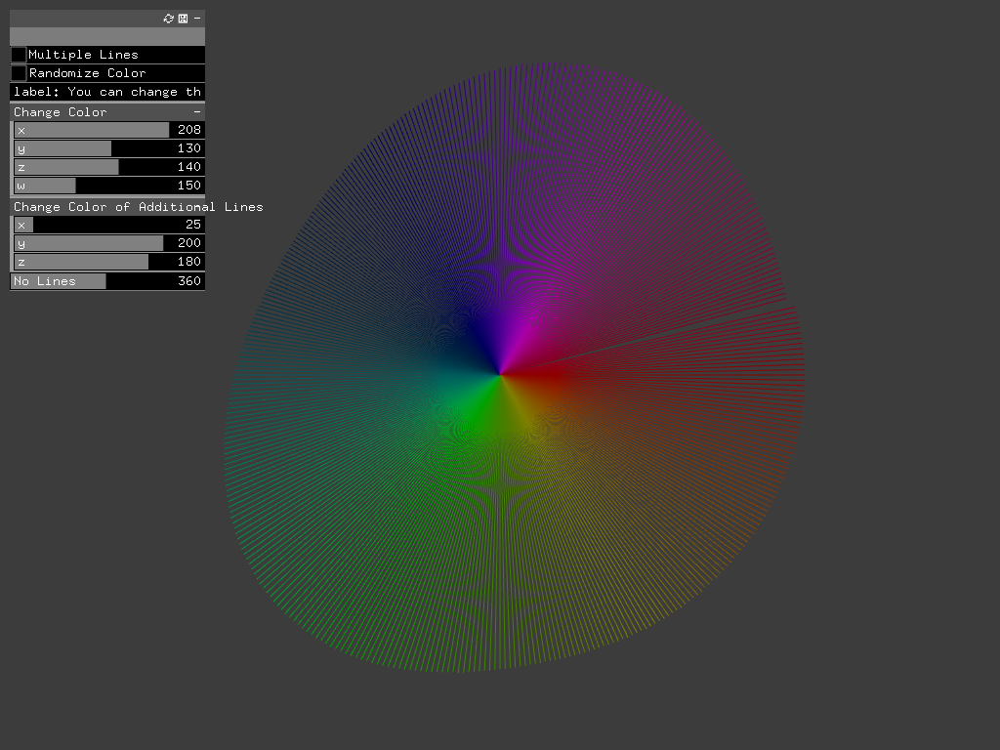

# Generate Lines

## Description 

*Coding an openFrameworks app that makes a drawing with lines and points that can be controlled by sliders.*


## Algorithm

- Calculating the radius 
- Adding 1 degree for each line 
- calculating the location using trig 
- finding the color w.r.t. the location

```C++

for (int i = 1; i < intSlider; i++) {
        
        noisex1 += 0.01;
        radius = ofMap(ofNoise(noisex1), 0, 1, minRadius, maxRadius);
         
         
         
        deg +=  1;
        
        radian = (TWO_PI / 360) * (deg % 360);
        location.x = radius * cos(radian);
        location.y = radius * sin(radian);
        
        c.setHsb(ofMap(radian, 0, TWO_PI, 0, 255), 255, ofMap(radius, minRadius, maxRadius, 0, 255), 255);
        ofSetColor(c);
        
        ofDrawLine(ofGetWindowWidth()/2, ofGetWindowHeight()/2, ofGetWindowWidth()/2+location.x, ofGetWindowHeight()/2+location.y);
}

```

## Sample Outputs








